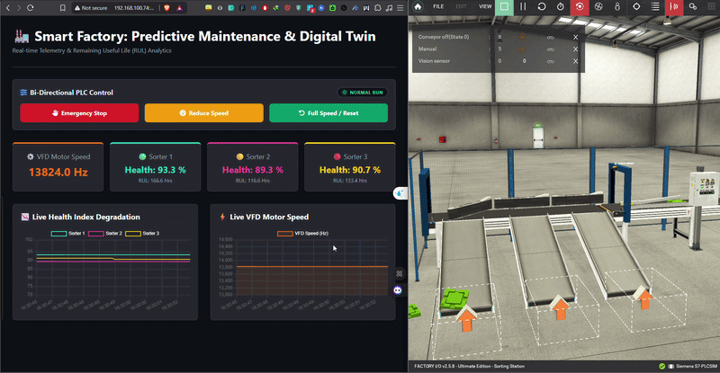

# 🏭 Smart Factory: Digital Twin & Predictive Maintenance System

## 📌 Project Overview
This project presents a fully functional **Digital Twin** and **Predictive Maintenance** framework for an automated sorting station. Designed as a proof-of-concept for Industry 4.0 applications, it integrates industrial control systems (Siemens PLC) with a high-level Python backend and a modern web dashboard. 

The system enables **real-time bidirectional control**, live telemetry monitoring, and Remaining Useful Life (RUL) estimation for industrial motors and sorters, bridging the gap between Operational Technology (OT) and Information Technology (IT).

### 🎥 System Demonstration
> **Note to evaluator:** *Below is a live demonstration of the bidirectional control and real-time telemetry.*

---

## 🚀 Key Features

* **Real-Time Digital Twin:** Seamless synchronization between the virtual factory environment (Factory I/O) and the web dashboard.
* **Bi-Directional PLC Control:** Send commands directly from the web interface (Emergency Stop, Speed Reduction, Reset) to the Siemens PLC using the `Snap7` library.
* **Predictive Maintenance & RUL Analytics:** Live monitoring of Health Index Degradation and VFD Motor Speed anomalies, calculating the Remaining Useful Life (RUL) of the sorting machines.
* **Live Data Visualization:** Dynamic, real-time charts built with WebSockets to display sensor data and motor frequencies instantly.
* **Automated Data Logging:** Telemetry data is continuously logged into structured datasets (CSV/SQLite) for future Machine Learning model training.

---

## 🏗️ System Architecture

The project relies on a 3-tier architecture:

1. **Physical/Simulation Layer (OT):** 
   * **Factory I/O:** Simulates the physical sorting station.
   * **Siemens TIA Portal (PLCSIM):** Runs the ladder logic (LAD) and automation algorithms.
2. **Middleware & Data Processing Layer (IT):**
   * **Python Server:** Acts as the bridge. Uses `python-snap7` to read/write memory directly from the PLC (e.g., `%M10.1` for speed reduction).
   * **Analytics Engine:** Processes raw telemetry into health scores and RUL metrics.
3. **Presentation Layer (Web UI):**
   * **Flask & SocketIO:** Pushes real-time data to the front-end.
   * **HTML/CSS/JS (Chart.js):** Renders the interactive dashboard.

---

## 🛠️ Technologies & Tools Used

* **Industrial Automation:** Siemens TIA Portal, Factory I/O, S7-PLCSIM.
* **Backend Development:** Python, Flask, Flask-SocketIO.
* **Industrial Communication:** `python-snap7` (S7 Communication Protocol).
* **Frontend Development:** HTML5, CSS3, JavaScript, Chart.js.
* **Data Processing:** Pandas, Datetime.

---

## ⚙️ How It Works (Technical Highlight)

Unlike traditional read-only dashboards, this system features **Active Intervention**. For instance, when the "Reduce Speed" button is triggered on the UI:
1. The Flask server receives the REST API / WebSocket command.
2. `Snap7` overwrites the specific boolean tag (`%M10.1`) in the PLC's memory.
3. The PLC's Ladder Logic dynamically scales down the Analog Output signal (`NORM_X` / `SCALE_X`).
4. The VFD in Factory I/O immediately reduces the conveyor speed.
5. The speed drop is reflected back on the dashboard's live chart in under 100ms.

---

## 🎓 Research & Academic Potential
This repository serves as a foundational framework for advanced research in:
* Implementing Edge-AI models for anomaly detection in automated manufacturing.
* Evaluating the latency of IT/OT integration protocols.
* Developing autonomous decision-making algorithms for preventative factory shutdowns.

---

## 👤 Author
**BENCHEIKH MOHAMED IDRIS**
* Technical Sales and Systems Engineer 
* Prospective PhD Candidate in Industrial Automation & Mechatronics
* www.linkedin.com/in/fresh-highachieving-automationengineer-bencheikh-mohamed-idris
* bencheikhmohamed800@gmail.com
